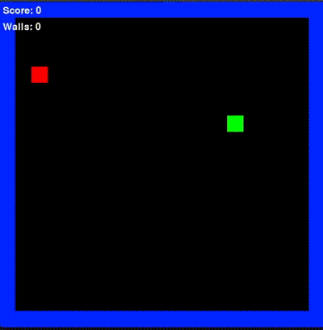

# Snake Game AI

Welcome to the **Snake Game AI** project! 🐍 This repository contains an implementation of a Snake game powered by artificial intelligence to autonomously play and optimize the classic snake game. 

## Features

- 🎮 **Playable Snake Game**: A fully functional modified version of snake game built using Python.
- 🧠 **AI-Powered Gameplay**: Uses search strategies and machine learning techniques to train an AI to play the game.
- 📊 **Visualization**: Real-time display of the game with the AI controlling the snake or user mode to play.

---
## Requirements

This project requires the following Python libraries:
- `pygame`
- `numpy`

### Installation

To install the required libraries and codebase, run the following commands:

```bash
pip install pygame
pip install numpy


**Clone the Repository**:
   ```bash
   git clone https://github.com/martinaghajanian/snake-game-ai.git
```

## Usage
Run the Game: Choose your AI agent
   ```bash
  python main.py
```
## Demo

Here’s a preview of the Snake Game AI in action (DFS algorithm):


